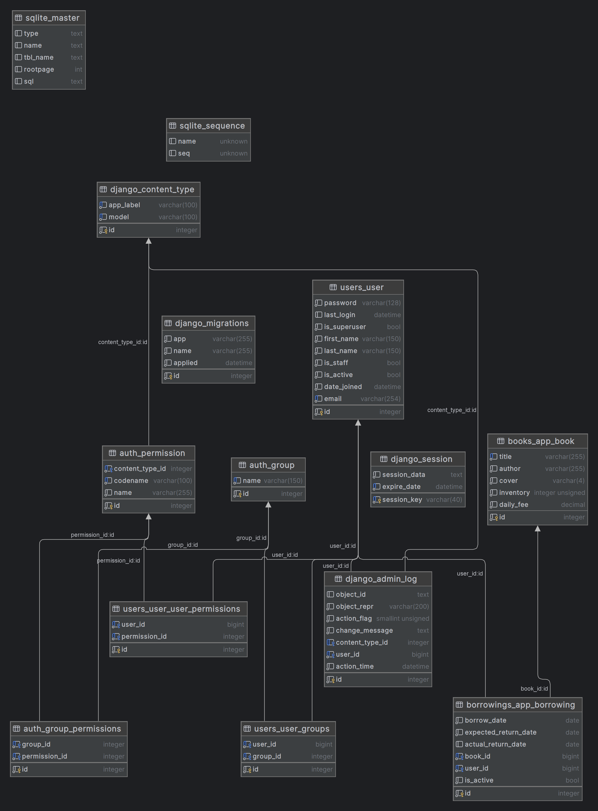

# Library Management System📚💻

Welcome to the Library Management System: a modern solution for tracking book borrowings and managing library operations.

## Project Description📖

In your city, there's a library where people borrow books and pay in cash based on the days they read the book. The current system is manual, with all tracking done on paper. This project aims to revamp the library system, introducing an online management system for book borrowings, optimizing administrative tasks, and enhancing user experience.

## Features🚀

- **Book Management**: Create, read, update, and delete books effortlessly.
- **User Management**: Easily manage user registrations, updates, and deletions with secure JWT authentication.
- **Borrowing Operations**: Streamline borrowing processes with features like creating, returning, and detailed borrowing information.
- **Notification System**: Receive instant notifications on each borrowing creation via a dedicated Telegram chat.
- **Private Data Protection**: Ensure the protection of private data with the implementation of environment variables.

## DataBase schema💻



## Installation🚀

## Using GitHub

1. Ensure you have Python 3 installed.
2. Clone the repository:

   ```bash
   git clone https://github.com/goldenuni/library-management-system.git
   cd library-management-system
### How to Run ▶️

1. Create a virtual environment: `python -m venv venv`
2. Activate the virtual environment:
   - On Windows: `venv\Scripts\activate`
   - On macOS: `source venv/bin/activate`
3. Install dependencies: `pip install -r requirements.txt`
4. Apply migrations: `python manage.py migrate`
5. Run the development server: `python manage.py runserver`

Explore the API using the provided Swagger UI and refer to the documentation for detailed instructions.

# Getting Started🚀
1. Create a user via /api/user/register ✨
2. Obtain an access token via /api/user/token 🔐

Explore the features of the Library Management System! ✨

Enjoy optimizing library operations and enhancing user experiences with the new online management system! 🌟
